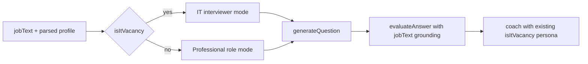

# 2026-06-26 — Vacancy-grounded interviews: any profession + deeper IT questions

## Goal

Expand the interview simulator beyond IT-only behavior so that:

1. **Any job posting** drives question topics and evaluation — warehouse worker, sales, accounting, manufacturing, etc.
2. The **original vacancy text** (`jobText`) is the primary source for questions and scoring, not only the parsed profile summary.
3. **IT vacancies** keep a separate, more challenging mode — system design, debugging, tradeoffs, failure modes — instead of generic trivia.

Related bug spec: `docs/spec/bugs/007-interview-it-only-not-vacancy-grounded.md`

## Problem (before)

| Area | Issue |
|------|-------|
| Question generation | Single IT-centric persona ("technical interviewer at a top tech company") for every role |
| Non-IT vacancies | Software-style question framing (`system_design`, `debugging_scenario`) applied to non-technical jobs |
| `jobText` | Stored in session state but not passed to `generateQuestion` or `evaluateAnswer` |
| Job parser | Examples and field wording skewed toward developers and tech stacks |
| Evaluation / coach | Already had `isItVacancy()` and "master practitioner" persona — question generation did not |

**User-visible effect:** pasting a warehouse worker or accountant vacancy could produce developer-style or generic questions that ignored duties and tools from the posting.

## Solution overview



Two prompt paths share the same `QuestionResult` schema and question-type enum; non-IT mode reinterprets types in a workplace context (e.g. `system_design` → workflow/process design, not software architecture).

## Changes

### 1. New module — `src/adk/utils/interview-prompts.ts`

Central prompt builders used by question generation and evaluation:

| Export | Purpose |
|--------|---------|
| `truncateJobText()` | Caps posting snippet at 3000 chars for LLM context |
| `buildVacancyContextBlock()` | Inserts original job posting into user prompt |
| `buildInterviewerSystemPrompt()` | IT vs non-IT system prompt via `isItVacancy()` |
| `buildInterviewerUserPrompt()` | Role, skills, keywords, weak areas + vacancy block |
| `buildEvaluatorVacancyGrounding()` | Tells evaluator to score against posting text |

**IT mode** (`isItVacancy()` = true):

- Persona: senior technical interviewer at a top tech company
- Questions require thinking, not recall
- Regular use of `system_design` and `debugging_scenario`
- Difficulty by level: junior → fundamentals; middle → architecture + tradeoffs; senior → system design + failure modes

**Non-IT mode**:

- Persona: hiring manager + senior practitioner in the role's domain
- Workplace scenarios from the posting: procedures, safety, compliance, tools
- Avoids IT jargon unless the posting requires it
- Same enum values, different semantic meaning in prompt instructions

### 2. `src/adk/tools/generate-question.tool.ts`

- Added optional `jobText` parameter to tool schema
- Replaced inline IT-only prompts with `interview-prompts` builders
- `resolveInterviewLanguage(jobProfile, jobText)` when job text is available

### 3. `src/adk/tools/evaluate-answer.tool.ts`

- Added optional `jobText` parameter
- System prompt includes `buildEvaluatorVacancyGrounding(jobText)` so scores reflect employer-stated duties and requirements

### 4. `src/adk/tools/parse-job.tool.ts`

- System prompt explicitly supports **any profession**
- Examples extended: Warehouse Worker, Sales Manager, Accountant
- `skills` described as professional skills/tools/systems (WMS, 1C, forklift license, Excel — not only programming languages)

### 5. Agents — wire `jobText` through pipeline

| Agent | Change |
|-------|--------|
| `src/adk/agents/interviewer.agent.ts` | Passes `state.jobText` to `generateQuestion` |
| `src/adk/agents/evaluator.agent.ts` | Passes `state.jobText` to `evaluateAnswer` |

Coach agent unchanged — already uses `isItVacancy()` via `evaluation-prompts.ts`.

### 6. Reused existing helper — `isItVacancy()`

Located in `src/adk/utils/evaluation-prompts.ts`. Detects IT roles from role, domain, skills, and keywords (with exclusion for mechanical/civil engineering). Now shared by evaluation, coaching, and question generation.

## Example behavior

**Warehouse worker vacancy (RU):**

> Требуется кладовщик. Опыт работы с WMS, проведение инвентаризации, знание FIFO…

Expected question style: inventory discrepancy handling, shift-end procedures, WMS reconciliation — not REST API or React.

**Backend developer vacancy:**

Expected question style: architecture tradeoffs, debugging production issues, scaling, failure modes — harder than "What is Node.js?"

## Tests added / updated

| File | Coverage |
|------|----------|
| `src/adk/utils/__tests__/interview-prompts.test.ts` | **New** — IT vs non-IT personas, vacancy block, truncation, evaluator grounding |
| `src/adk/tools/__tests__/generate-question.tool.test.ts` | Non-IT warehouse profile + `jobText` in prompt; existing language-retry tests preserved |

## Verification

```bash
npm run typecheck   # pass
npm run lint        # pass
npm run test        # 239/239 tests passed, 34 test files
```

## Manual smoke checklist

- [ ] Paste non-IT vacancy (warehouse / sales / accounting) → questions reference posting duties and tools
- [ ] Paste IT vacancy → questions are technical, varied, include design/debugging scenarios
- [ ] Russian posting → questions and feedback in Russian
- [ ] Evaluation recommendation references role-specific expectations from the posting

## Files changed

| File | Type |
|------|------|
| `src/adk/utils/interview-prompts.ts` | **New** |
| `src/adk/tools/generate-question.tool.ts` | Refactor + `jobText` param |
| `src/adk/tools/evaluate-answer.tool.ts` | `jobText` param + vacancy grounding |
| `src/adk/tools/parse-job.tool.ts` | Broader profession examples |
| `src/adk/agents/interviewer.agent.ts` | Pass `jobText` |
| `src/adk/agents/evaluator.agent.ts` | Pass `jobText` |
| `src/adk/utils/__tests__/interview-prompts.test.ts` | **New** |
| `src/adk/tools/__tests__/generate-question.tool.test.ts` | Extended |
| `docs/spec/bugs/007-interview-it-only-not-vacancy-grounded.md` | Bug spec (Fixed) |

## Out of scope (not changed)

- Frontend UI — no copy changes; `jobText` was already sent/stored by the web client
- `QuestionResult.questionType` enum — same 5 values; semantics differ by mode in prompts only
- `isItVacancy()` heuristics — not expanded in this change; edge cases (e.g. "data entry" matching IT domain pattern) may still misclassify rare postings

## Follow-ups (optional)

- Extend `isItVacancy()` with explicit non-IT role patterns (кладовщик, warehouse, cashier, etc.)
- Surface question mode (IT / professional) in UI for transparency
- Add integration test with mocked LLM asserting prompt content for warehouse vs developer profiles
