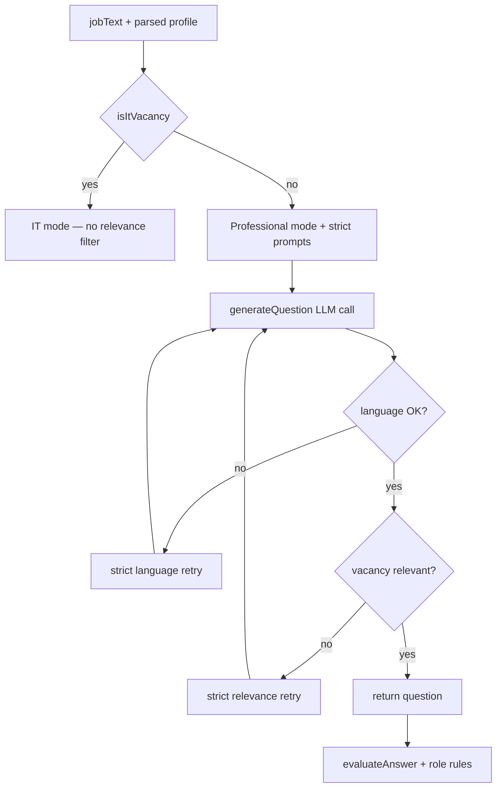

# 2026-06-27 — Non-IT vacancy relevance guard: stop IT question leakage

## Goal

Close the gap left after bug 007 (vacancy-grounded interviews): ensure that **non-IT vacancies** receive **interesting, realistic questions and evaluation** grounded in the **original vacancy text** — without IT/cloud/software scenarios leaking in from LLM hallucination or company marketing copy.

Related bug spec: `docs/spec/bugs/008-non-it-vacancy-it-questions-leakage.md`  
Builds on: `docs/reports/2026-06-26-vacancy-grounded-interviews.md`

## Problem (before)

| Area | Issue |
|------|-------|
| Question generation | Non-IT prompt mode existed (bug 007), but LLM still sometimes generated AWS/Python/microservices questions |
| Design engineer vacancies | Postings with "ИИ" / "R&D" in company perks triggered software-style questions unrelated to duties (КОМПАС, ЕСКД, Э3/Э4) |
| Retry logic | Only **language** mismatches triggered regeneration — off-topic IT questions were accepted |
| Job parser | Could infer programming/cloud skills from marketing sections, not only requirements |
| Evaluation | Vacancy grounding present, but no explicit rule against IT-style `perfectAnswerSummary` for non-IT roles |

**User-visible effect:** pasting a vacancy for **«Инженер-проектировщик»** (lighting control panels, electrical design) could produce a question like *"How would you organize Python microservices on AWS for sensor data?"* — valid for an IoT/backend role, absurd for a CAD/electrical design position.

## Solution overview



Two layers of defense for non-IT roles:

1. **Stronger prompts and parser** — forbid IT topics unless listed in requirements; ignore marketing slogans
2. **Post-generation guard** — detect forbidden IT terms not present in vacancy haystack; retry with `CRITICAL RELEVANCE RETRY`

## Changes

### 1. New module — `src/adk/utils/vacancy-relevance.ts`

| Export | Purpose |
|--------|---------|
| `isQuestionVacancyRelevant()` | For non-IT profiles: rejects questions containing AWS, microservices, React, etc. unless those terms appear in role/skills/keywords/jobText |
| `extractForbiddenItTerms()` | Lists leaked IT terminology in generated question/topic |
| `buildStrictRelevanceRetryRule()` | System prompt block injected on retry with offending terms |
| `buildAllowedTermsHaystack()` | Allowlist from profile + `jobText` |
| `filterMarketingKeywords()` | Strips marketing-only phrases ("инновационный подход с ИИ", "R&D center") |

IT vacancies skip the relevance filter — AWS/Python questions remain valid when the posting requires them.

### 2. Question generation — dual retry loop

`src/adk/tools/generate-question.tool.ts`:

- Up to **4 attempts**: normal → strict language → strict relevance → both strict
- Question returned only when **language** and **vacancy relevance** pass
- Throws if all attempts fail

### 3. Stronger non-IT interview prompts

`src/adk/utils/interview-prompts.ts`:

- Vacancy block clarified as **ORIGINAL VACANCY TEXT** — primary source; marketing ("ИИ", "R&D") is not a job requirement unless listed under duties
- Every question must reference at least one concrete duty/tool from the posting
- **STRICTLY FORBIDDEN** for non-IT unless in vacancy: Python, AWS, microservices, Docker, Kubernetes, REST/API, React, Vue, DevOps
- **Interesting question shapes** with domain inspiration:
  - Electrical design: Э3 vs assembly discrepancy, protection devices for panels up to 1000V
  - Warehouse: WMS stock mismatch at shift end
  - Sales: CRM conflict with verbal client agreement
- `strictRelevanceRetry` option adds `CRITICAL RELEVANCE RETRY` with offending terms from failed attempt

### 4. Evaluator — role-specific rules

`src/adk/utils/evaluation-prompts.ts`:

- New `buildEvaluatorRoleRules()` — separate IT vs non-IT evaluation benchmarks
- Non-IT: do not penalize for lacking software knowledge; do not suggest Python/AWS perfect answers; reward practical judgment with employer terminology

`src/adk/tools/evaluate-answer.tool.ts`:

- System prompt includes `buildEvaluatorRoleRules(jobProfile)`

### 5. Job parser — stricter skill extraction

`src/adk/tools/parse-job.tool.ts`:

- Do not infer Python/AWS/Vue from marketing ("инновационный подход", "R&D", "использование ИИ")
- Explicit rule for **инженер-проектировщик**: extract КОМПАС, ЕСКД, Э3/Э4, protection devices — not cloud/programming unless in requirements
- Marketing phrases → keywords for context only, never `skills`

## Example behavior

**Electrical design engineer vacancy (RU):**

> Инженер-проектировщик. Щиты освещения до 1000В. КОМПАС 3D, ЕСКД, Э3/Э4. Компания: инновационный подход с использованием ИИ…

| Before | After |
|--------|-------|
| «Микросервисная архитектура на Python и AWS для датчиков и реле» | «На производстве расхождение между Э3 и сборкой щита освещения — ваши действия и оформление по ЕСКД?» |
| Evaluation suggests cloud architecture | Evaluation benchmarks against КОМПАС, схемы, аппараты защиты |

**Backend developer vacancy (EN):**

> Python, AWS, microservices, fault tolerance…

Unchanged — IT mode, AWS/microservices questions still generated and evaluated against posting stack.

## Tests added / updated

| File | Coverage |
|------|----------|
| `src/adk/utils/__tests__/vacancy-relevance.test.ts` | **New** — flags AWS/Python for design engineer; accepts ЕСКД/Э3 question; allows AWS for IT; marketing keyword filter |
| `src/adk/utils/__tests__/interview-prompts.test.ts` | STRICTLY FORBIDDEN block; strict relevance retry rule |
| `src/adk/utils/__tests__/evaluation-prompts.test.ts` | Non-IT evaluator forbids IT perfect answers |
| `src/adk/tools/__tests__/generate-question.tool.test.ts` | Off-topic retry when first question mentions AWS/Python for design engineer |

## Verification

```bash
npm run typecheck   # pass
npm run lint        # pass
npm run test        # 252/252 tests passed, 35 test files
```

## Manual smoke checklist

- [ ] Paste **инженер-проектировщик** vacancy with "ИИ" in perks → questions about CAD/schematics/production, not AWS/Python
- [ ] Paste **Backend Developer** with AWS in requirements → IT/cloud questions still work
- [ ] Evaluation `perfectAnswerSummary` for design engineer uses posting tools, not software stack
- [ ] Warehouse / sales vacancies still use professional mode from bug 007

## Files changed

| File | Type |
|------|------|
| `src/adk/utils/vacancy-relevance.ts` | **New** |
| `src/adk/utils/interview-prompts.ts` | Enhanced non-IT rules + relevance retry |
| `src/adk/utils/evaluation-prompts.ts` | `buildEvaluatorRoleRules()` |
| `src/adk/tools/generate-question.tool.ts` | Relevance retry loop |
| `src/adk/tools/evaluate-answer.tool.ts` | Role-specific evaluation rules |
| `src/adk/tools/parse-job.tool.ts` | Stricter skill extraction |
| `src/adk/utils/__tests__/vacancy-relevance.test.ts` | **New** |
| `src/adk/utils/__tests__/interview-prompts.test.ts` | Extended |
| `src/adk/utils/__tests__/evaluation-prompts.test.ts` | Extended |
| `src/adk/tools/__tests__/generate-question.tool.test.ts` | Off-topic retry test |
| `docs/spec/bugs/008-non-it-vacancy-it-questions-leakage.md` | Bug spec (Fixed) |

## Out of scope (not changed)

- **Candidate resume** as separate input — simulator still uses one text field (vacancy description)
- Frontend UI — no label or copy changes
- `isItVacancy()` heuristics — not expanded beyond bug 007
- Coach agent — unchanged; already uses `isItVacancy()` persona

## Follow-ups (optional)

- Add optional **resume text** field for personalized questions ("In your CV you mention explosion-proof equipment…")
- Surface relevance retry / question mode in UI or debug logs
- Extend forbidden-term list for other domain mismatches (e.g. medical vs logistics jargon)
- Integration test with real LLM smoke run for design engineer vs backend profiles
